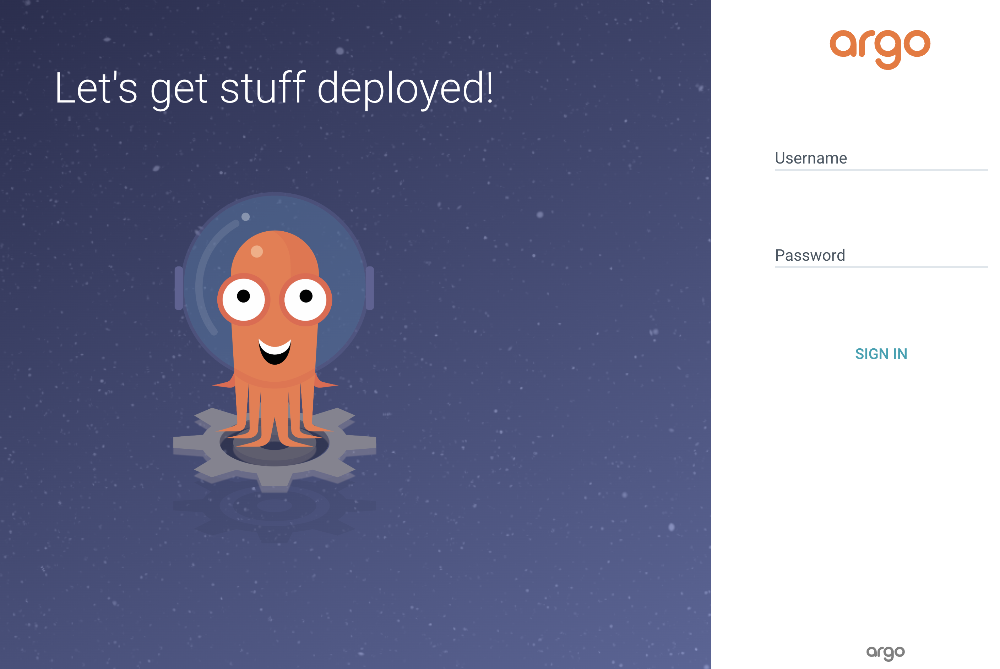
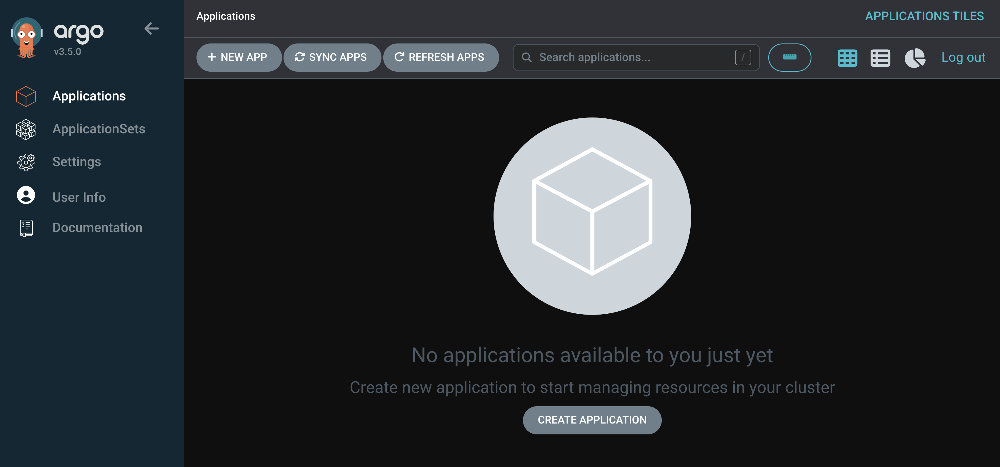
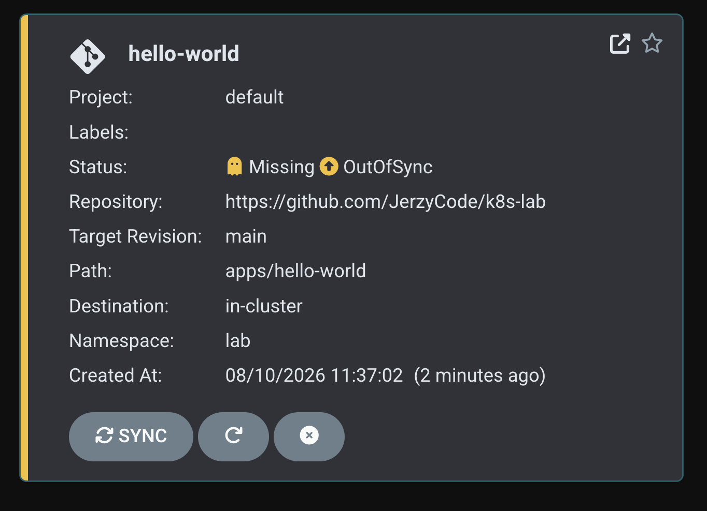
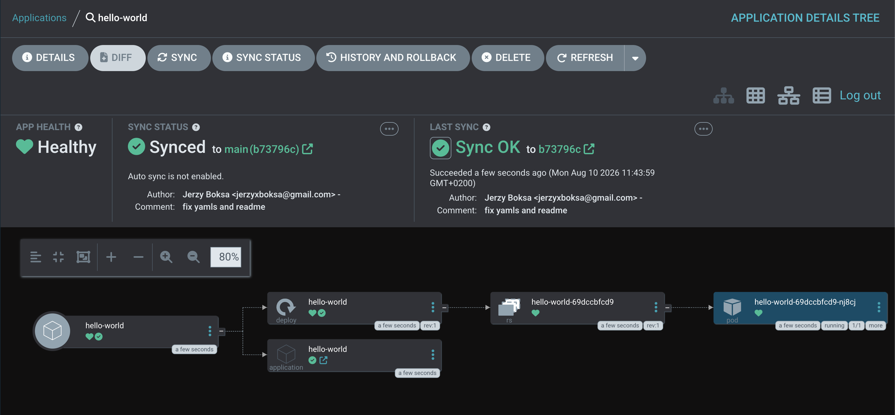
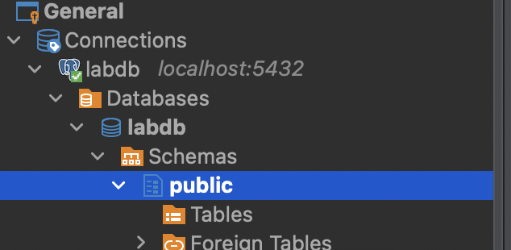

# k8s-lab

Projekt zawiera mini laboratorium z kubernetes'a oraz argocd do uruchomienia na lokalnym komputerze.

## Wymagania
- git
- docker
- [uv](https://docs.astral.sh/uv/getting-started/installation/)
- [minikube](https://minikube.sigs.k8s.io/docs/)


## Kroki do wykoniania

### 1. Instalacja narzędzi

### 2. Uruchomienie klastra

komenda:
```bash
jerzyb@MacBook-Air-Jerzy Projekty % minikube start
```

**Sprawdzenie czy wstał:**

```bash
jerzyb@MacBook-Air-Jerzy Projekty % kubectl get nodes
NAME       STATUS   ROLES           AGE   VERSION
minikube   Ready    control-plane   29s   v1.35.1
```

### 3. Stworzenie namespace'a i Instalacja ARGO w klastrze

**namespace** - sposób logicznego dzielenia jednego klastra Kubernetes na odizolowane od siebie "przegródki". To trochę jak foldery na dysku.

Przykładowo:

```bash
jerzyb@MacBook-Air-Jerzy Projekty % kubectl get namespace
NAME              STATUS   AGE
default           Active   2m20s
kube-node-lease   Active   2m20s
kube-public       Active   2m20s
kube-system       Active   2m20s
```

**Stworzenie nowego namespace'a:**

```bash
kubectl create namespace argocd
```

**Instalacja argocd w namespace:**

```bash
kubectl apply -n argocd -f https://raw.githubusercontent.com/argoproj/argo-cd/stable/manifests/install.yaml
```

**Weryfikacja czy pody się podniosły:**

**pod** - najmniejsza jednostka, którą Kubernetes odpala i zarządza — w praktyce: jeden lub kilka kontenerów, które zawsze żyją i umierają razem, na tym samym nodzie, dzieląc sieć i (opcjonalnie) dysk. Pod ≈ "jedna instancja Twojej aplikacji działająca w klastrze". Jak masz Deployment z replicas: 3, to dostajesz 3 pody — każdy to osobny, żyjący proces (a właściwie grupa procesów) gdzieś na nodzie.

```bash
jerzyb@MacBook-Air-Jerzy Projekty % kubectl get pods -n argocd -w
NAME                                                READY   STATUS    RESTARTS   AGE
argocd-application-controller-0                     1/1     Running   0          113s
argocd-applicationset-controller-568dfdf75b-2ltmn   1/1     Running   0          113s
argocd-dex-server-856bcdf9ff-r7z8q                  1/1     Running   0          113s
argocd-notifications-controller-6b4fd8f59-zvnl6     1/1     Running   0          113s
argocd-redis-54c57dd6ff-fstmw                       1/1     Running   0          113s
argocd-repo-server-fd55df7c-7cvrc                   1/1     Running   0          113s
argocd-server-6cd5f98457-rbct4                      1/1     Running   0          113s
```

### 4. Dostęp do Argo UI

Na razie Argo działa wewnątrz klastra, ale nie ma jeszcze jak zajrzeć do UI z przeglądarki - trzeba zrobić port-forward, żeby wystawić argocd-server na Twój localhost.

Komenda:

```bash
kubectl port-forward svc/argocd-server -n argocd 8080:443
```

**UWAGA**: To zablokuje terminal - powinien on zostać otwarty

Powinna być możliwość żeby wejść na adres https://localhost:8080 na którym jest strona logowania do argo.



### 5. Dane do logowania

**Wyciągnięcie hasła**

```bash
kubectl -n argocd get secret argocd-initial-admin-secret -o jsonpath="{.data.password}" | base64 -d
```

Zostanie wypisane w terminalu hasło, można je zmienić w następujący sposób.

1. Logujemy się przez gui



2. Wchodzimy w zakładkę UserInfo i tam zmieniamy hasło - w celach laba, np. na `Admin123`


## Projekt typu hello-world
Najprostszy deploy z argo aplikacji typu `hello-world`. Warto zaznajomić się z plikami w `apps/hello-world` - zawierają one wyjaśnienia pól oraz tego co dany plik robi i za co odpowiada.

**Dodanie do argo tokenu do gita**

Jeśli repozytorium jest prywatne należy wejść w settings i zestawić połaczenie z gitlabem. Np. wygenerować token na potrzeby laba i go dodać.

Należy teraz zaaplikować ten plik, żeby był widoczny w argo. Można to zrobić przy pomocy cli lub przez gui.

W katalogu z projektem:
```bash
kubectl apply -f apps/hello-world/application.yaml
```

W gui powinno być widoczne:


Następnie po kliknięciu sync w detalach aplikacji jest:



W ramach testów polecam zmienić w pliku liczbę replicas i kliknąć sync.

Aby usuąć aplikację komenda: `kubectl delete -f apps/hello-world/application.yaml` lub przez GUI.

## OpenwebUI on k8s

Kroki:

```bash
kubectl apply -f apps/openwebui/application.yaml
```
a nas†ępnie podobnie jak w aplikacji `hello-world` - klikamy Sync.

Ponownie aby dobić się do aplikacji trzeba zrobić port-forward:

```bash
kubectl port-forward -n lab deployment/openwebui 3000:8080
```
Następnie dostęp do aplikacji jest pod adresem: `http://localhost:3000/`

Podgląd logów:

```bash
```bash
kubectl logs -n lab -l app=openwebui -f
```

## Alembic init job before deploy replicas

Zaczynamy od dodania aplikacj postgres - katalog apps/postgres.

```bash
kubectl apply -f apps/postgres/application.yaml
```

Ponownie forward żeby się dobić do tej bazy np. przez DBeaver: `kubectl port-forward -n lab svc/postgres 5432:5432`.

Można zauważyć, że tabele są puste:



W sample-alembic-app znajduje się gotowa aplikacja z migracjami do testowania.